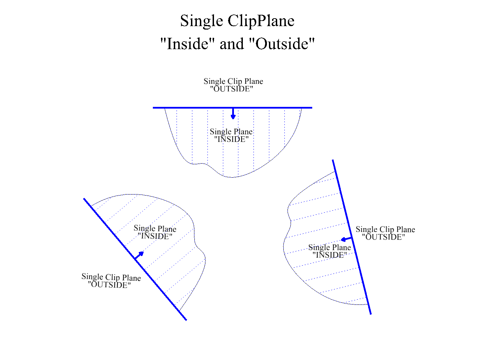
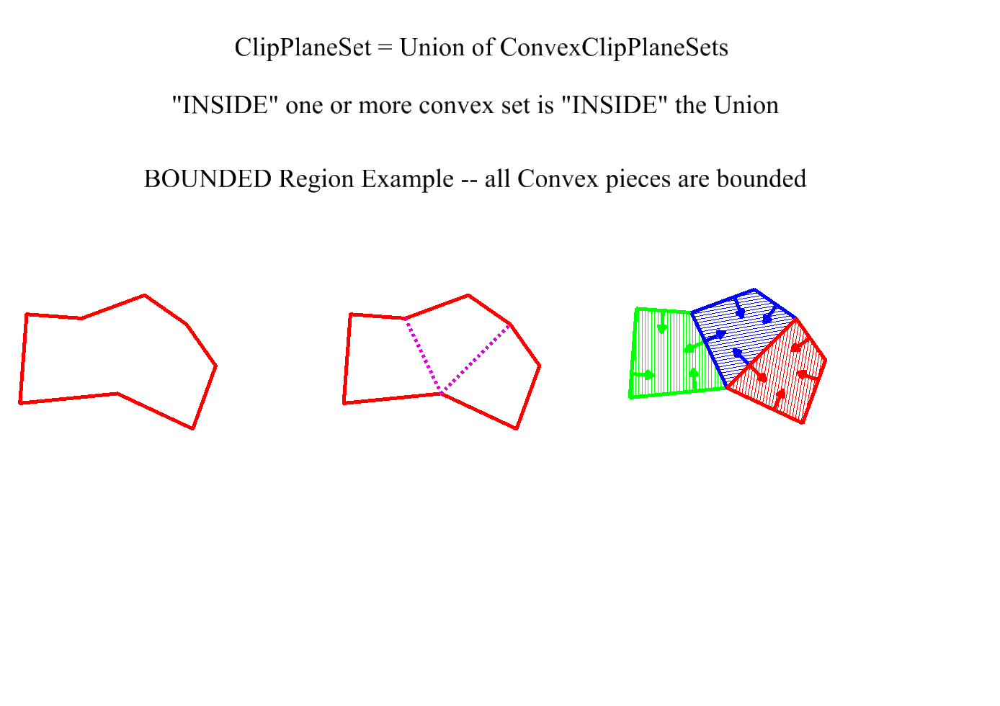

# Classic Planar Clips: ClipPlane, ConvexClipPlaneSet, UnionOfConvexClipPlaneSet

ClipPlane, ConvexClipPlaneSet, and UnionOfConvexClipPlaneSets form a clear sequence of complexity:

| Class | Content | semantics |
|---------------|-------------------|--------------|
| ClipPlane | Single clip plane | Splits the universe into two halfspaces at planar boundary |
| ConvexClipPlaneSet | Array of clip planes | convex region which is the _intersection_ of the half spaces |
| UnionOfConvexClipPlaneSets | Array of ConvexClipPlaneSet | _union_ of the convex regions |

## ClipPlane

* A single ClipPlane is a plane.
* The (unbounded, infinite) space on one side is called "in".
* The (unbounded, infinite) space on the other side is called "out".
* The clip plane stores an inward normal.

## ConvexClipPlaneSet

* A point is _inside_ the convex region if and only if it is inside every ClipPlane
* If a point its _outside_ any single ClipPlane it is outside of the convex region.
* Hence in/out test has quick exit for _out_ but must loop over all planes for _in_.
* A ConvexClipPlaneSet can be unbounded.
  * A ConvexClipPlaneSet with one member is always unbounded
  * A ConvexClipPlaneSet with two members is always unbounded.
  * Within a plane, it takes a minimum of 3 planes (lines in the plane) to bound a (convex polygonal) area
  * In full 3d, it takes a minimum o 4 planes to make the convex volume bounded.

## UnionOfConvexClipPlaneSets remarks

* The ConvexClipPlaneSet members of a UnionOfConvexClipPlaneSets are assumed non-overlapping
  * Test for "point inside" can terminate at first "inside" of a ConvexClipPlaneSet member
  * When clipping a polygon, if a fragment is found to be inside a ConvexClipPlaneSet member the fragment may be accepted "as is" -- no need to consider also being in other ConvexClipPlaneSet members.
* A non-convex polygon must be represented by a collection of convex pieces (e.g. triangles).
* A non-convex polygon must be represented by a collection of convex pieces that wrap around the hole (e.g. triangles)

# ClipPrimitive, ClipShape and ClipVector

ClipPrimitive and ClipVector are legacy classes from the Microstation display pipeline.

## ClipPrimitive

A ClipPrimitive is a carrier for a UnionOfConvexClipPlaneSet.   It also has a flag _invisible indicating that its usual "inside" is really a hole.

The ClipPrimitive class typically exists as a base class for another class (e.g. ClipShape) that has a definition of the clip region in terms other than planes.   Most commonly, a ClipShape carries a polygon that is to be swept go generate the UnionOfConvexClipPlaneSets in the ClipPrimitive part.

The methods in ClipPrimitive allow for the UnionOfConvexClipPlaneSets to be constructed "late" by the derived class (e.g. ClipShape) rather than immediately upon creation.

## ClipVector

A ClipVector contains an array of ClipPrimitives.   The interior of the ClipVector is the _intersection_ of the "interiors of the ClipPrimitives".  Due to the _interior flag of the ClipPrimitive, those ClipPrimitives may be acting as holes in the ClipVector.

# Clipper -- generic interface for point, line, and arc clipping

Clipper is an interface whose methods (such as point clip, line clip, and arc clip) are to be supported by various concrete classes.

Clipper methods are supported by:
  * ClipPlane
  * ConvexClipPlaneset
  * UnionOfConvexClipPlaneSet
  * Ellipsoid
  * BooleanClipNode -- the base class for trees of clip operations.

The methods are:
| Method | summary |
|-------------------|--------------|
| isPointOnOrInside(point: Point3d, tolerance?: number): boolean | test if point is inside, with optional tolerance around boundaries |
| announceClippedSegmentIntervals(f0: number, f1: number, pointA: Point3d, pointB: Point3d, announce?: AnnounceNumberNumber): boolean | Determine portions of a line segment that are inside the clipper.  Announce such portion as fractional start and end. |
| announceClippedArcIntervals(arc: Arc3d, announce?: AnnounceNumberNumberCurvePrimitive): boolean; | Determine portions of an arc that are within the clipper.   Announce each as fractional start and end. |

# NEEDS WORK !!
* bspline clipping -- non-existent?
* polygon clipping
  * point, line, and arc clipping easily fit the method set in the Clipper interface.
  * polygon clipping is "harder" because there can be many pieces of output.
    * The most generic method signature, appropriate for large clippers like UnionOfConvexClipPlaneSet
  * methods on ConvexClipPlaneSet
    * public clipConvexPolygonInPlace(xyz: GrowableXYZArray, work: GrowableXYZArray, tolerance: number = Geometry.smallMetricDistance)
    * public clipInsidePushOutside(xyz: GrowableXYZArray, outsideFragments: GrowableXYZArray[]
    arrayCache: GrowableXYZArrayCache): GrowableXYZArray | undefined
    * polygonClip(input: GrowableXYZArray | Point3d[], output: GrowableXYZArray, work: GrowableXYZArray, planeToSkip?: ClipPlane)
      * _only_ the inside part.
      * nonconvex is actually ok, but may produce double-back edges.
    * clipUnboundedSegment (pointA, pointB, announce: (fractionA: number, fractionB: number)=>void
    *  public hasIntersectionWithRay(ray: Ray3d, result?: Range1d): boolean
      * return true if there is any intersection with a ray.  Optionally identify the intersection range.
* methods on ClipPlane
  * clipConvexPolygonInPlace(xyz: GrowableXYZArray, work: GrowableXYZArray, inside: boolean = true, tolerance: number = Geometry.smallMetricDistance)
    * `inside` parameter allows simple reversal to outside part.
    * Note that the "in place" clip to a single result is possible here (ClipPlane) but not for multi-plane structures that create fragments.
    * Uses IndexedXYZCollectionPolygonOps.clipCOnvexPolygonInPlace()
  * intersectRange(range: Range3d, addClosurePoint: boolean = false): GrowableXYZArray | undefined
* methods on UnionOfConvexClipPlaneSets
  *   public isAnyPointInOrOnFromSegment(segment: LineSegment3d): boolean
    * quick exit on first "inside" piece
  *  appendIntervalsFromSegment(segment: LineSegment3d, intervals: Segment1d[])
  *  polygonClip(input: GrowableXYZArray | Point3d[], output: GrowableXYZArray[])
    * Uses convexSet.polygonClip
* methods on IndexedXYZCollectionPolygonOps
  *  public static splitConvexPolygonInsideOutsidePlane(plane: PlaneAltitudeEvaluator,  xyz: IndexedReadWriteXYZCollection,     xyzPositive: IndexedReadWriteXYZCollection, xyzNegative: IndexedReadWriteXYZCollection, altitudeRange: Range1d)
  * near-identical method with more specific GrowableXYZArray
  * gatherCutLoopsFromPlaneClip(plane: PlaneAltitudeEvaluator, xyz: GrowableXYZArray, minChainLength: number = 3, tolerance: number = Geometry.smallMetricDistance): CutLoopMergeContext
  *  intersectRangeConvexPolygonInPlace(range: Range3d, xyz: GrowableXYZArray): GrowableXYZArray | undefined

# Cache users

Using a GrowableXYZArrayCache is a hint that a method is intended for heavy usage.

Used in files:
* ConvexClipPlaneSet.ts
  * convexSet.clipInsidePushOutside
* PolyfaceClip.ts
  * clipPolyfaceUnionOfConvexClipPlaneSetsToBuilders