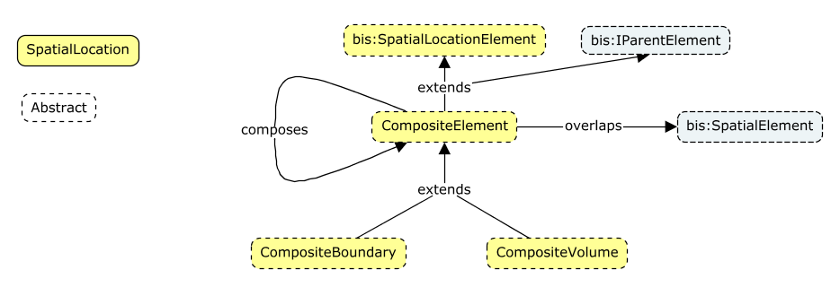

# Spatial Composition (alias spcomp)

This schema describes the breakdown of `SpatialLocationElement`. It is intended to be used across disciplines. For instance, it is meant to allow making a single hierarchy that composes instances of `buildingspatial:BuildableVolume` into a `site:Site`. The composition relationship can be applied in a recursive manner, i.e. a composed element can be composed into another composition. Cyclic references are prevented by rules in the `domain handler`. Semantically, composition means that composer and composed elements describe the same volume of space and therefore sharing a geometric location is not a conflict, it is actually expected. Compositions imply a dependency, i.e. the definition of the whole depends on the definition of the parts and the parts depend on the existence of the whole. The behavior that is implied by the dependency is established and maintained inside applications.



## Design considerations

- This schema does not use either of the two available [breakdown mechanisms](./../intro/modeling-with-bis.md) in `BIS` (`IParent` and models). The direct reason is that instances of `CompositeElement` uploaded by [iModel bridges](./../intro/imodel-bridges.md) can be persisted in arbitrary models. Reusing a standardized `BIS` breakdown mechanism is desired but no appropriate, model agnostic, mechanism is currently available.
- Decomposition is modeled after IFC. We like to align as much as possible with the industry standard.

## Naming considerations

- Avoid negatives in terms (eg. "unhappy", "disqualified"), these tend to get confusing (ie. "I'm not denying that I'm no longer unhappy"). Therefore compose is favored over decompose.

## Classes

### CompositeElement

A spatial element that may be Composite of other CompositeElements

Naming :
1 - Do not repeat the name of the base type `SpatialLocation`, it makes the name to long especially when this name is repeated in the relationship names later. Leaving that out makes the name sound more general than it should however namespace should resolve that.
2 - Do not use Composed since leaf nodes will not be composed.
3 - Equivalent of `IfcSpatialStructureElement`.

```xml
    <ECEntityClass typeName="CompositeElement" modifier="Abstract">
        <BaseClass>bis:SpatialLocationElement</BaseClass>
        <BaseClass>bis:IParentElement</BaseClass>
        <ECNavigationProperty propertyName="ComposingElement" relationshipName="CompositeComposesSubComposites" direction="Backward" description="The Composite Element" />
    </ECEntityClass>
```

### CompositeBoundary

A CompositeElement that is delimited by a curve on a terrain. We expect a closed curve on a surface as geometry.

Naming :
1 - Boundary indicates a 2 dimensional perimeter (on a terrain surface) for the location.

```xml
    <ECEntityClass typeName="CompositeBoundary" modifier="Abstract">
        <BaseClass>CompositeElement</BaseClass>
    </ECEntityClass>
```

### CompositeVolume

A CompositeElement that is delimited by a volume

Naming :
1 - Volume indicates a 3d solid object to delimit the spatial location.

```xml
    <ECEntityClass typeName="CompositeVolume" modifier="Abstract">
        <BaseClass>CompositeElement</BaseClass>
    </ECEntityClass>
```

## Relationships

### CompositeComposesSubComposites

*TODO derive from `BIS` equivalent of `IElementOwnsChildElements`.*

Naming :
1 - Equivalent of : `IfcRelAggregates`.

Relates the Composer with its' composees

```xml
    <ECRelationshipClass typeName="CompositeComposesSubComposites" strength="embedding" modifier="None">
      <!-- Relationship that indicates a decomposition of child CompositeElement -->
      <Source multiplicity="(0..1)" roleLabel="composes" polymorphic="true">
        <Class class="CompositeElement"/>
      </Source>
      <Target multiplicity="(0..*)" roleLabel="is part of" polymorphic="true">
        <Class class="CompositeElement"/>
      </Target>
    </ECRelationshipClass>
```

### CompositeOverlapsSpatialElements

CompositeOverlapsSpatialElements is a relationship to mark that an element is (at least partially) overlapping with a `CompositeVolume`. If an overlap is established between a `CompositeVolume` and a `SpatialElement` like for instance a room containing a chair, this also suggests overlap with the room's `Story` therefore overlaps should not be repeated on different levels of composition (`Space`, `Story`, `Building`, `Site`).

Naming :
1 - Equivalent of : `IfcSpatialStructureElement.ContainsElements`.
2 - the verb "Contains" is avoided since it suggests that the containment is complete (nothing sticks out). We allow partial containment (aka overlap) when for instance a duct runs through multiple spaces.

```xml
    <ECRelationshipClass typeName="CompositeOverlapsSpatialElements" modifier="None" strength="referencing">
      <BaseClass>bis:ElementRefersToElements</BaseClass>
        <Source multiplicity="(0..*)" roleLabel="contains" polymorphic="true">
            <Class class="CompositeElement"/>
        </Source>
        <Target multiplicity="(0..*)" roleLabel="is contained by" polymorphic="true">
            <Class class="bis:SpatialElement"/>
        </Target>
    </ECRelationshipClass>
```

## Code

Name|Value
--|--
CodeValue|NULL
CodeScope|CodeScopeSpec::Repository
CodeSpec|bis:NullCodeSpec