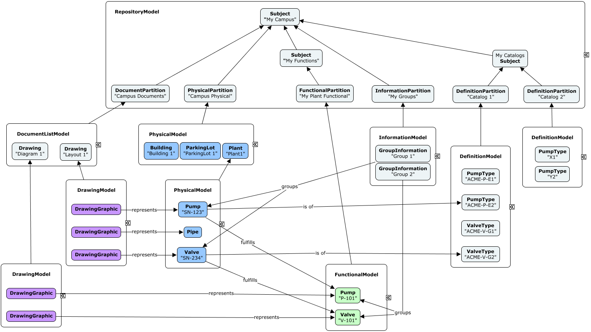

# Information Hierarchy

<!-- TODO: Some of the information in this chapter will likely be moved to [Model Fundamentals](./model-fundamentals.md). It will be natural to have links from this chapter to that one. -->

The information in a BIS repository is arranged in a hierarchy that is governed by rules. Some of the rules are explicitly defined by the schemas, and other rules require the applications that are creating data to follow standards.

The hierarchies in BIS repositories are intended to facilitate both human and software comprehension of the data.

## Hierarchy Constructs

As was explained in [Model Fundamentals](../foundation/model-fundamentals.md), there are only three mechanisms available in BIS to create a hierarchy:

<!-- TODO: This is no longer true. There are more mechanisms in BIS to create a hierarchy. E.g. SpatialComposition, External Sources -->

* A Model can contain Elements
* An Element can own child Elements
* An Element can be *modeled* by (broken down into more detail by) a *SubModel*

Each of these three mechanism is intended to be used in specific circumstances which are explained in this chapter.

### Model Contains Elements

A Model is a *container* for Elements.
Models are a way to subdivide and organize the overall repository.
Each Element is contained by exactly 1 Model as defined by the `ModelContainsElements` relationship.

### Element Owns Child Elements

An Element can own child Elements.
This is useful for modeling *assembly* relationships or for modeling cases where one Element exclusively controls the lifetime of other Elements.
An Element can have 0 or 1 parent Elements as defined by the `ElementOwnsChildElements` relationship.
An Element without a parent is considered a *top-level* Element.
An Element with a parent is considered a *child* Element.
These hierarchies can go N levels deep, which means that an Element can be both a parent and a child.

### Model Models Element

A Model is more detail about an Element from a higher level in the information hierarchy.
A Model is about exactly 1 Element as defined by the `ModelModelsElement` relationship.
From the Model's perspective, this higher-level Element is known as the *modeled element*.
From the Element's perspective, the lower-level Model is knows as the *SubModel*.
The *SubModel* term is just a way to refer to a relative position in the information hierarchy.
There is no special class for a *SubModel*, only the standard `Model` subclasses.

For example, a `DrawingModel` breaks down a `Drawing` Element and contains the `DrawingGraphic` Elements that are the details of the overall drawing.

<!-- TODO: insert figure -->

## Top of the World

The top of the information hierarchy is strictly controlled and is very similar in all BIS repositories. Its contents are explained in [Top of the World](./top-of-the-world.md)

<!-- TODO
## Typical Repository Organization

Two examples of repository organizations are described below. It should be noted that a single BIS repository may have multiple uses. When that occurs each use (often corresponding to an application) adds the hierarchy; the resulting hierarchy is similar to a union of the uses' hierarchies.

### iModel Connector Repository Organization

TODO: show organization for an iModel created by both:

* One connector with two source files
* Another connector with one source file

### Editing Application Repository Organization

TODO

-->

## Example Information Hierarchy

&nbsp;

&nbsp;

---
| Next: [Modeling Perspectives](./modeling-perspectives.md)
|:---
