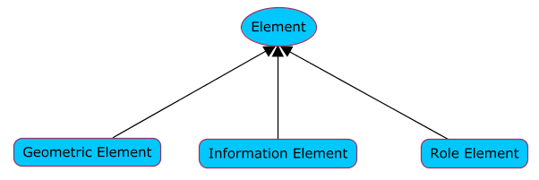
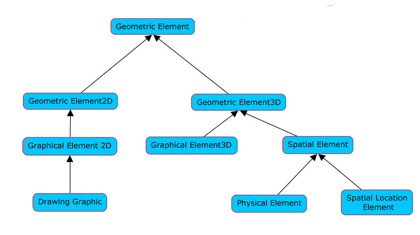
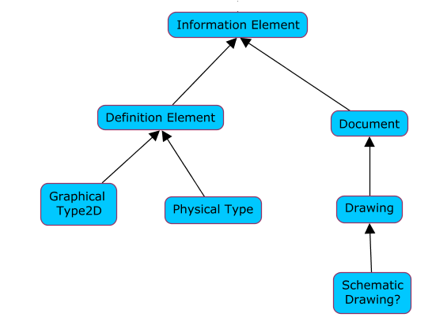
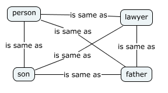
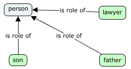

# Element Fundamentals

A BIS `Element` represents an entity in the real world, e.g. pumps, beams, contracts, companies, processes, requirements, documents, persons, etc.

## BIS Element Properties

The properties of an element are defined in its [Schema](./schemas-domains.md). Every Element in BIS derives from the `Element` class. This section describes the properties of the Element class, and therefore the properties that *every* Element in an iModel has.

### CodeSpec

See [CodeSpec](./codes.md#codespec-property)

### CodeScope

See [CodeScope](./codes.md#codescope-property)

### CodeValue

See [CodeValue](./codes.md#codevalue-property)

### FederationGuid

Every BIS `Element` has an optional 128 bit [Globally Unique Identifier](https://en.wikipedia.org/wiki/Universally_unique_identifier) called `FederationGuid`. Generally it is intended that FederationGuid are assigned by external systems to *federate* Elements to their external meaning.

### UserLabel

Every BIS `Element` has an optional `UserLabel` property, to provide an *alias* familiar to the user.
The UserLabel may serve an alternate “friendlier” name in a GUI, e.g. the Room with `CodeValue`="R-134" might have `UserLabel`=”The Big Kitchen” or `UserLabel`=”John’s Office”.
There is no uniqueness constraint placed on the `UserLabel`.

With the exception of data conversion programs, the UserLabel is always left for the user to enter and is not programmatically generated.

### JsonProperties

The `JsonProperties` member holds instance-specific *ad hoc* data on an Element in JSON format. It is a dictionary of key-value pairs, where the key is a *namespace* (see below) and the value is a JSON object. In this manner the `JsonProperties` member can hold any form and complexity of externally-defined (i.e. outside of BIS) data on any element.

To avoid conflicts in naming values, the top-level names for members of `JsonProperties` are reserved for *namespaces*. There is no registry for namespaces, so they should be chosen to be long and unique enough to avoid the possibility of collision (at least 8 characters).

> Note: all JSON property names, and therefore namespaces, are *case sensitive*.

#### The `UserProps` namespace

There is a reserved namespace of JsonProperties called `UserProps`. All values in the UserProps namespace are meant to be added by users, and application code should never store information there. Users should store their properties in names with their own name-scoping rules, such as a capitalized prefix to avoid conflicts. But since they know that only their data is held in the UserProps, they don't need to worry about collisions with applications.

For example, an Element may have the following set of JsonProperties:

```json
{
  "SLYSOFT_props": {
    "partType": "st-10",
    "partName": "runner*144"
  },
  "IGASPEC_domFlow": {
    "max": 100,
    "min": 22
  },
  "UserProps": {
    "BTTE_vendorInfo": {
      "name": "Ace Manufacturing",
      "contractId": "1032SW3"
    },
    "BTTE_approvals": {
      "reviewers": ["Tom", "Justine", "Nate"],
      "date": "2018-02-11",
      "notes": ""
    }
  }
}
```

### Advantages and Disadvantages of JsonProperties

The largest advantage of JSON properties is that they do not require any schema or up-front work at all. The disadvantages of JSON properties are:

- No type-safety. There is no mechanism for controlling what is stored for any property name.
- No required data. There is no mechanism for defining the requirement for certain properties to be defined.

<!-- TODO
### JsonProperties and ECSQL
-->

## Elements and Models

Each Element *lives in* a single Model. That Model *contains* and *owns* the Element. Models cannot be deleted unless all of their Elements are first deleted. Models provide context and scope for their Elements.

Every `Model` models (breaks down or describes) some `Element`. This is the basic building block of the [Information Hierarchy](./information-hierarchy.md), which is a key principle of BIS and supports modeling of reality from multiple perspectives and multiple granularities in a single Repository. It also results in a coherent and predictable structure in every BIS Repository, where all information is traceable to a single [Root Subject](./glossary.md#subject-root) for the entire BIS Repository.

There is one exception to the “Every Model models an Element” rule: There is exactly one RepositoryModel in every BIS Repository which does not Model another Element (at least not another Element in the same BIS Repository). This RepositoryModel is at the top of the Model/Element [Information Hierarchy](./information-hierarchy.md).

## ElementIds in iModels

When stored in an iModel, Elements also have a unique 64-bit *local* identifier, called an ElementId. ElementId is generated when new Elements are created by storing the BriefcaseId in the high 24 bits, with the next-available sequence number in the lower 40 bits. This allows new Elements to be created in any Briefcase without fear of ElementId collision.

<!-- TODO
What is a briefcase?
-->

## Elements and Child Elements

An Element may have child Elements. Both the parent and the children must live in the same Model. The parent-child relationship implies ownership and cascading deletes. This is discussed more in the [Assemblies](#assemblies) section below.

## Core Element Classes

These are subclasses of Element defined in the `BisCore` schema from which all other Element classes must descend:

- `GeometricElement`
- `InformationContentElement`
- `RoleElement`

&nbsp;

&nbsp;

### GeometricElement

`GeometricElement` represents any real world entity that we chose to model as inherently being geometric, such that it can be displayed graphically.
This includes physical entities (such as electrical panels, beams and pumps) as well as drawing graphics (lines, arcs, circles, and annotations like text, plots, etc) in geometric context.
Merely having a geometric property is not necessarily enough to merit an entity being represented by a `GeometricElement`; for example, a steel section shape is an `DefinitionElement`, not a `GeometricElement`.

&nbsp;

&nbsp;

The `GeometricElement` hierarchy defined in the `BisCore` schema is broken down as shown in the figure above.

Brief descriptions for the classes in the 2d branch are:

- `GeometricElement2d` – An Element that is inherently 2d in nature.
- `GraphicalElement2d` – A 2d Element that holds graphical information rather than geometry that has business meaning.
- `DrawingGraphic` – A 2d graphical Element that is intended to be placed on a Drawing.

Brief descriptions for the classes in the 3d branch are:

- `GeometricElement3d` – An Element that is inherently 3d in nature.
- `GraphicalElement3d` – A 3d Element that holds graphical information rather than geometry that has business meaning. Examples include text annotations or 3d bar charts. Instances of `GraphicalElement3d` are typically positioned for *whitespace* reasons since they are not tied to real-world 3d space.
- `SpatialElement` – An Element representing an entity that exists in and is relevant to real-world 3d space.
- `PhysicalElement` – A SpatialElement representing a real physical entity, i.e. one that has mass.
- `SpatialLocationElement` – A SpatialElement representing some defined point, curve, surface, or volume in the real world. Spatial locations are not physical, and have no mass. Examples include a property line, a zoning envelope, an alignment, or a gridline.

### InformationContentElement

<!-- TODO: More needed here... -->

An `InformationContentElement` is an Element that exists to carry and track information.  Information Elements are inherently non-geometric and cannot be graphically displayed, but can contain geometric properties (for definition or specification purposes).

Examples include:

- A document
- A shared definition
- A requirement
- A specification
- An information record

&nbsp;

&nbsp;

### RoleElement

Roles play a vital role (pun intended) in the ability of BIS to break down application-specific domain silos into pieces that allow common information to be shared and leveraged.

&nbsp;

&nbsp;

Use person/lawyer/father/son example

&nbsp;

&nbsp;

&nbsp;

&nbsp;

&nbsp;

&nbsp;

Roles are linked to each other through the PhysicalElement.

Each role may include some redundant information, but should generally share the physical form and properties of the `PhysicalElement`.

In our virtual world, roles can get “out of sync” with the PhysicalElements, and can even exist without the corresponding PhysicalElement existing. These out of sync cases often represent incomplete work (the P&ID has changed, but the 3d model has not yet been updated to reflect the changes), but sometimes reflect a long-term condition (the vehicle role is modeled in the asset management system, but there is no need to create the physical model of the truck).

## Assemblies

An Element can optionally have a *parent* Element. Parent Elements must be in the same Model as their children. A hierarchy of Elements can be created through these parent-child relationships (note: all the Elements in a hierarchy will reside in the same Model). An Element that is a parent can be considered to *assemble* its children and, collectively, they are termed an *Assembly*. Assemblies can nest. Circular networks of parent-child relationship are not allowed.

Assemblies imply ownership and cascading deletes. When a parent Element is deleted, all of its children are deleted as well.

Assemblies tend to follow three patterns:

1. The assembly is purely an aggregation; the primary role of the parent is to group the children together (example: a rebar cage collects various reinforcing bars together)
2. The assembly is an elaboration; properties (or other information) in the parent allow the children to be generated (example: a pipe support generates a pipe clamp, a beam clamp and a threaded rod)
3. The assembly is an item with modifications; the parent defines a base that the children modify (example: a BeamCope modifies a Beam).

As an Element can only have a single parent, it is important that domains and applications coordinate to ensure there is no conflict over which parent an Element should have. The best general rule to coordinate parenthood is that the domain author determines which Elements (if any) can be parents of its Elements.

Elements classes will generally fall into four categories:

1. The Element can have any or no parents (example: Bolt).
2. The Element cannot have a parent.
3. The Element can only have a parent of a particular class.
4. The Element always has a parent, but there is little restraint on the class of the parent (example: Hole).

When designing assemblies, care must be taken to avoid double-counting.

See also the IParentElement and ISubModeledElement section below.

## IParentElement and ISubModeledElement

This section tries not to repeat the material in [Model Fundamentals](./model-fundamentals.md) and [Information Hierarchy](../data-organization/information-hierarchy.md).
If you have questions about how Elements breakdown into Models, you may want to skim those articles.

There are two mixins that declare and define key behaviors of an Element:

- `IParentElement` – this Element can be a parent Element
- `ISubModeledElement` – this Element can have an associated breakdown Model

The Element class does not include either of these interfaces, so by default no Element can have children or can be broken down into a Model. Many Elements have no need for child Elements or breakdown Models and will therefore use neither of these mixins. A Bolt class is a example of a class that requires neither.

These mixins are expected to be mutually-exclusive. No class that implements `IParentElement` will also implement `ISubModeledElement`. The reason these two mixins are considered mutually-exclusive is that the two concepts (having children and having a model) are both means of breaking down something into more detail; using two different breakdown methods simultaneously could result in confusion and double-counting.

## Parent-Child Relationships

All Element parent-child relationships descend from `ElementOwnsChildElements`, which should not be used directly.
There are specializations (subclasses) of the `ElementOwnsChildElements` relationship that clarify the relationship of the parent and child.
Examples include:

- `PhysicalElementEAssemblesElements` – used to indicate that the child Elements are aggregated into the parent Element, whose geometry is entirely an aggregation.
- `ElementEncapsulatesChildElements` – used when the child Elements represent internal data that is not typically exposed to user or useful outside of the parent Element’s context.
- `SubjectOwnsSubjects`, `SubjectOwnsPartitionElements` - these relationships are used to constrain the set of Elements that are valid *children* of a `Subject` Element.

## Groups

While parent-child relationships are of *embedding* strength and imply exclusive ownership, grouping relationships are of *referencing* strength and imply non-exclusive membership.

The grouping technique will vary depending on whether grouping a collection of member Elements is:

1. The primary role of the Element or
2. A secondary role of the Element.

In the first case, the `ElementGroupsMembers` relationship is used to relate group members to a `GroupInformationElement` that stands in for the group overall.
A `GroupInformationElement` has no other reason to exist other than for grouping.

In the second case, a standard 1:N relationship can be used and grouping is implied.
The grouping Element in this case would be valuable and exist whether or not it has members.

<!-- TODO?
## Core Element Relationships
Must descend from one of the main relationship sub-types
Model Contains Elements
Element->Model (few variations)
Element owns child Elements
Element->ElementAspect
(other)
-->

---
| Next: [Codes](./codes.md)
|:---
