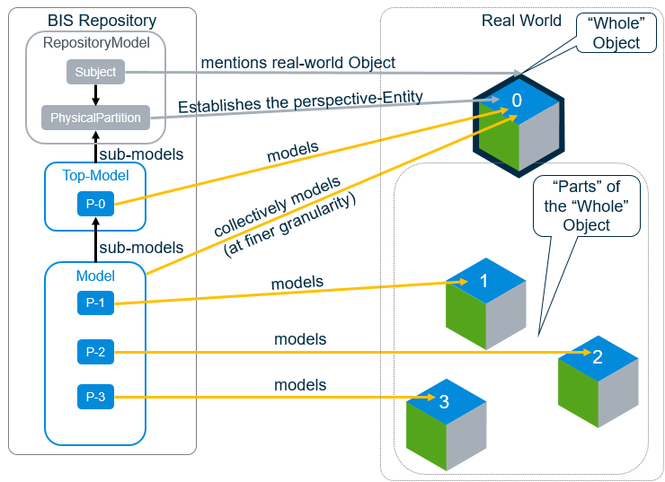
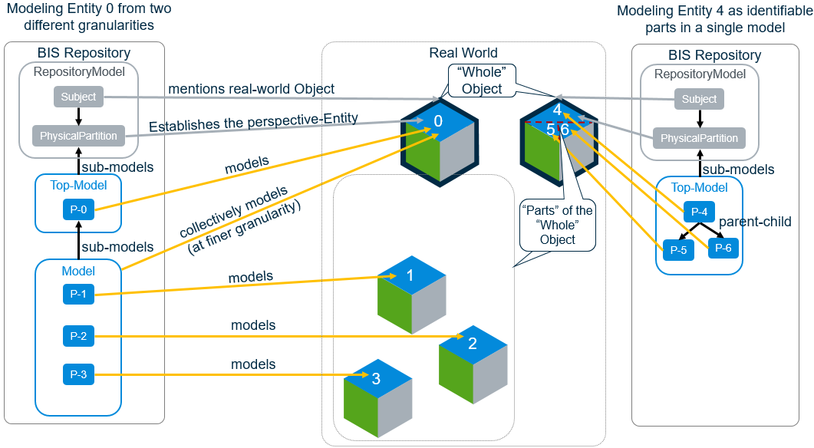
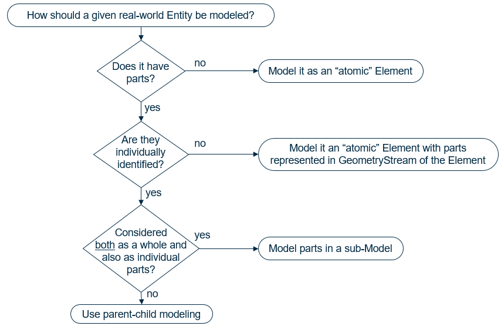

# Organizing Models and Elements

[Information Hierarchy](./information-hierarchy.md) explains the mechanics of how `Element`s can be organized into various kinds of hierarchies, which can be used together to model [Entities](../glossary.md#Entity) in the real-world from various [Modeling Perspectives](./modeling-perspectives.md) and at various [Modeling Granularities](../glossary.md#Granularity).

[Top of the World](./top-of-the-world.md) explains how and why Elements are structured within the [RepositoryModel](../glossary.md#RepositoryModel) to describe what the [BIS Repository](../glossary.md#Bis-Repository) is “about”. The ‘leaf nodes’ in the `RepositoryModel` are [InformationPartitionElements](../glossary.md#InformationPartitionElement) (henceforth “partitions”) that establish a [Modeling Perspective](./modeling-perspectives.md) for a given [Subject](../glossary.md#Subject).

This topic reviews those fundamentals and provides guidance to [Domain](../glossary.md#Domain) authors and client developers on how and why Models and Elements are organized under partitions. Before diving into detailed explanations, we summarize the rules reviewed or established in this topic.

## A Summary of Principles and Rules for Modeling with BIS

These principles and rules govern how `Model`s and `Element`s are organized to model real-world [Objects](../glossary.md#Object).

- BIS conceives that a real-world Object consists of multiple [Entities](../glossary.md#Entity), each from a different [Modeling Perspective.](./modeling-perspectives.md)
- An `Element` models an [Entity](../glossary.md#Entity).
- An `Element` can only be placed in a `Model` of compatible [Modeling Perspective](./modeling-perspectives.md).
- A sub-Model of an `Element` models the same [Entity](../glossary.md#Entity) as the `Element`, but at a finer granularity.
- `Model`s can only sub-model `Element`s of a compatible [Modeling Perspective](./modeling-perspectives.md).
- A parent `Element` identifies an [Entity](../glossary.md#Entity) and may model a part of it, but it together with its child `Element`s model the [Entity](../glossary.md#Entity).
- Parent `Element`s and Child `Element`s must be in the same `Model`.
- A single party should be responsible for all `Element`s in a given `Model`.
- A single party can be responsible for multiple `Model`s.
- Modeling the physical perspective:
  - Organize `PhysicalModel`s and `PhysicalElement`s primarily around the implementations of physical systems (that implement functions). These will tend to align with responsibility boundaries.
  - Where a physical Entity is part of multiple physical systems, it should be modeled by a `PhysicalElement` in a `Model` owned by the primary responsible party. Other parties can “share” the `PhysicalElement` using a `PhysicalElementIncludesPhysicalElement` relationship.
- Within the constraints above, the domain author can impose additional organization for domain-specific reasons.
- Domain authors should give users flexibility to further-partition for arbitrary reasons, so what could logically be modeled in a single `Model` could be partitioned into two, with one “including” the other.
- “Include” relationships should never be recursive.
- Software should not be too “rigid” in its expectations of how `Element`s are organized in to `Model`s, especially in the physical perspective. Functional and analytical `Model`s can be more rigid, because they are highly-specialized.

## The Top-Model for Each Perspective

### A top-Model models a top-level Entity from a specified perspective

As described in [Top of the World](./top-of-the-world.md) the root `Subject` identifies the real-world [Object](../glossary.md#Object) modeled in a `BIS Repository`.  When [modeling an Object with BIS](../intro/modeling-with-bis.md) it is split into multiple [Entities](../glossary.md#Entity), one for each modeling perspective.  Each modeling perspective is represented by a partition `Element` added as a child of the `Subject`.  A top-Model is created for each partition to model the Object from the Entities perspective.

In summary:

- **Subject**: mentions/identifies the highest-level Object to be modeled.
- **Partition**: establishes the perspective-specific Entity of the Object to be modeled.
- **Top-Model**:  models the Entity from the given perspective.

### Contents of a top-Model

The top-`Model` models the complete [Entity](../glossary.md#Entity) established by the `Subject` and partition.

The top-`Model` should contain one `Element` for each discrete Object included in the `Subject`. When the modeled `Subject` refers to a single discrete Object, the top-`Model` will contain only a single `Element` that corresponds directly to a perspective on that Object. In this case, the Code and DisplayLabel of that `Element` may be the same or similar to that of the `Subject` (particularly if this is the [Primary Perspective] for the Object) because they are “about” the same thing.

When the modeled `Subject` is ‘compound’ (referring to multiple discrete Objects), there will be multiple `Element`s in the top-`Model`. An example compound-`Subject` might be “Deliverables of Phase II of Project X”. The project’s contract will contain a list of the top-level things-to-be-built, and the top-`Model` would contain one `Element` for each thing-to-be-built in that list. This honors the [Single Responsible Party Principal (SRPP)](./srpp.md) because one General Contractor will ultimately be responsible for all of the deliverables.

If you find that a top-`Model` is unable to follow the [SRPP](./srpp.md), then the modeled-`Subject` needs to be decomposed into child `Subject`s. For example, with a compound-`Subject` like “The Dock and the largest boat that must be able to dock there”. The top-`Model` for that `Subject` would contain separate `Element`s for the dock and the boat, but a single party is unlikely to be responsible for both. Creating “Dock” and “Boat” child `Subject`s solves this problem.

## Modeling from the “Top-Model” on down

The top-`Model` is where modeling from a given perspective really begins. As a domain author, you are faced with many options for modeling your domain, which are described below.

### Multiple domain contexts

There will be distinct Digital Twins for design phases like Design, Construction, and Operations, and for major categories of infrastructure like Cities or Buildings or other facilities. There should be as much commonality among these as possible, but the domain author must have an awareness of the kinds of Digital Twins and the range of workflows where their domain is relevant. The modeling decisions discussed below occur in the context of those Digital Twins and workflows.

Domain authors should study examples of other domain schemas to see how others have addressed modeling challenges.

### The many considerations

The domain author has a tough job. They must consider:

- **Object boundaries**: Consider the real-world and conceptually carve it up into [Objects](../glossary.md#Object)
- **Entity boundaries**: Carve those Objects up into [Entities](../glossary.md#Entity).
- **Whole-part relationships**: Consider the whole-part relationships among the [Entities](../glossary.md#Entity) (and how to model them.)
- **Other Relationships**: Consider other relationships among [Entities](../glossary.md#Entity) (and how to model them).
- **Attributes**: Consider the attributes of the [Entities](../glossary.md#Entity) (and how to model them).

The “Object boundaries” consideration is business-as-usual for data modelers and will not be covered here.

The “Entity boundaries” consideration is covered in discussions of [Modeling Perspectives](./modeling-perspectives.md).

The remaining considerations will be covered in the following sections.

## Whole-Part Relationships

Each Entity will be modeled with an `Element`. Does the [Entity](../glossary.md#Entity) have “parts” that are worth modeling individually in the given context? The answer to that question will lead to one of three choices:

- **“Atomic” Element**: There are no “parts” to model. Atomic `Element`s can still model significant internal structure using the GeometryStream, Properties, and `ElementAspect`s.
- **Parent-Child Modeling**: The whole Entity is modeled as “parts” consisting of a parent `Element` and its child `Element`s. The “sum” of the parent and child `Element`s models the whole Entity. These `Element`s implement `IParentElement`. See [Parent-Child Relationships](../fundamentals/element-fundamentals.md#Parent-Child-Relationships).
- **Sub-modeling**: The “parts” are modeled in a sub-`Model` of this `Element`. The sub-modeled `Element` represents the whole Entity. The “sum” of all `Element`s in the sub-`Model` of the `Element` also represents the whole Entity, but at a finer granularity. These `Element`s implement `ISubModeledElement`.

In the picture below, Entity 0 is modeled with an `ISubModeledElement`, so `Element` P-0 represents the whole [Entity](../glossary.md#Entity) 0, and its sub-`Model` also represents the whole [Entity](../glossary.md#Entity) 0, at a different granularity.  [Entity](../glossary.md#Entity) 4 is modeled as an `IParentElement`, so `Element`s P-4, P-5, and P-6 collectively represent [Entity](../glossary.md#Entity) 4 and its parts.

Use these questions to determine whether to use parent-child modeling vs sub-modeling:

That last question needs elaboration. What are typical reasons why users need to both model the [Entity](../glossary.md#Entity) as-a-whole and also model it as a collection of fine-grained parts? Reasons include:

- According to the [SRPP](./srpp.md), if one party determines that X should exist in a particular place, but delegates responsibility for modeling X in detail to a second party, the delegate would need to do their work in their own `Model`.
- If some workflows want to deal with the Entity-as-a-whole, but other workflows (e.g. fabrication for construction) need to deal with it as a set of parts, the fabricator would want a `Model` focused on the parts used to fabricate the whole.

As a boundary case, if one of the parts is clearly a “lead” part, e.g. a “Beam” with specific additions (welded on) or subtractions (cut out) then maybe parent-child is more appropriate. The decision to use parent-child modeling vs sub-modeling can be quite tricky. You should examine schemas from comparable domains and consult experts, if possible.

---
| Next: [Modeling Systems](./modeling-systems.md)
|:---
