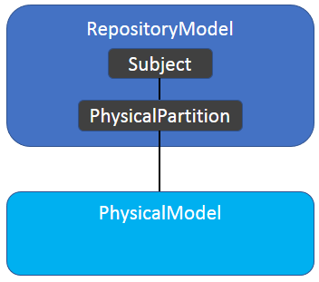

# PhysicalModel Hierarchy

## Introduction

Each `Subject` in a BIS Repository can have one `PhysicalPartition` child Element, under which the `PhysicalModel`s pertaining to the `Subject` will be organized using mechanisms described in [Model Hierarchy](information-hierarchy.md). The Model Hierarchy is constrained by [Modeling Perspective](information-hierarchy.md#InformationPartitionElements), but within the Physical Perspective, it is desirable to further organize Models according to Sites, Facilities, Systems, and Components to make the hierarchy of Models understandable by software and users.

&nbsp;

&nbsp;

## Physical Backbone

A key organizational strategy for both the BIS schemas and the organization of data within BIS repositories is the “physical backbone”. For schema design the physical world is a unifying reality upon which all disciplines can agree when coming to a consensus on how to represent something in BIS.

Within a BIS repository, the representation of the physical world becomes the framework upon which we can organize other data. All data in BIS repositories is expected to be about or related to physical infrastructure. The physical infrastructure is modeled as a hierarchy and other non-physical information is stored relative to that hierarchy.

## Organization Strategy

### Motivations

BIS defines a data model that is shared by a growing set of applications and services. Many of these applications and services read and/or write `PhysicalModel` data. There are two choices to ensure that these applications and services will be coordinated:

- Require every application and service to work with any data organization.
- Specify a data organization which applications and services should read and write.

 The second option has been chosen for BIS as it is the more practical solution.

 The strategy and organization described in this page may seem overly complex to domain developers who *just want to model a widget network*. These developers naturally want a simple organization that has a network of widgets in the top-most PhysicalModel. The problem with this *widget-centric* data organization is that there will be users who want to model widget networks, thingamajig systems and doohickey facilities and coordinate between them; how can these users do that if the top model is dedicated to widgets?

 BIS has been created to facilitate multi-discipline coordination, and that naturally adds some complexity to single-discipline use cases.

### PhysicalModels and Sub-modeling

As described in [Model Hierarchy](../data-organization/information-hierarchy.md), every `Model` " "sub-models" an `Element`. The `Model` and the `Element` represent the same real-world Entity, but the `Model` provides more granular information about the Entity.

Sub-`Model`s are weakly-typed in BIS. To understand the real-world Entity that a `Model` is modeling, it is necessary to look at the `Element` which the `Model` is sub-modeling.

***Note: PhysicalModel should not be subclassed.*** The few `PhysicalModel` subclasses that exist are deprecated and should not be used. When a term such as "Site Model" is used, it indicates "a `Model` that sub-models a `Site`", but does not indicate a strongly-typed `SiteModel`.

There is no strict requirement limiting the top `PhysicalModel` to contain only a single `PhysicalElement`. iModels that are generated from other repositories will sometimes have top `PhysicalModel`s with multiple `PhysicalElement`s if that best matches the organization of the source data. Legacy data may also have a non-standard organization.

---
| Next: [Physical Models and Elements](./physical-models-and-elements.md)
|:---
