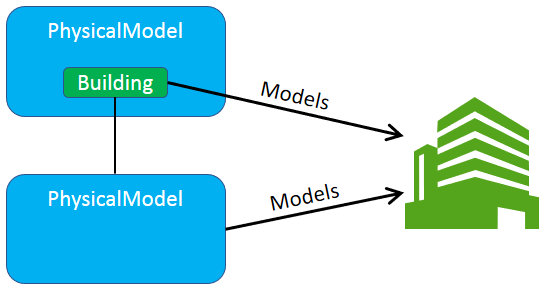
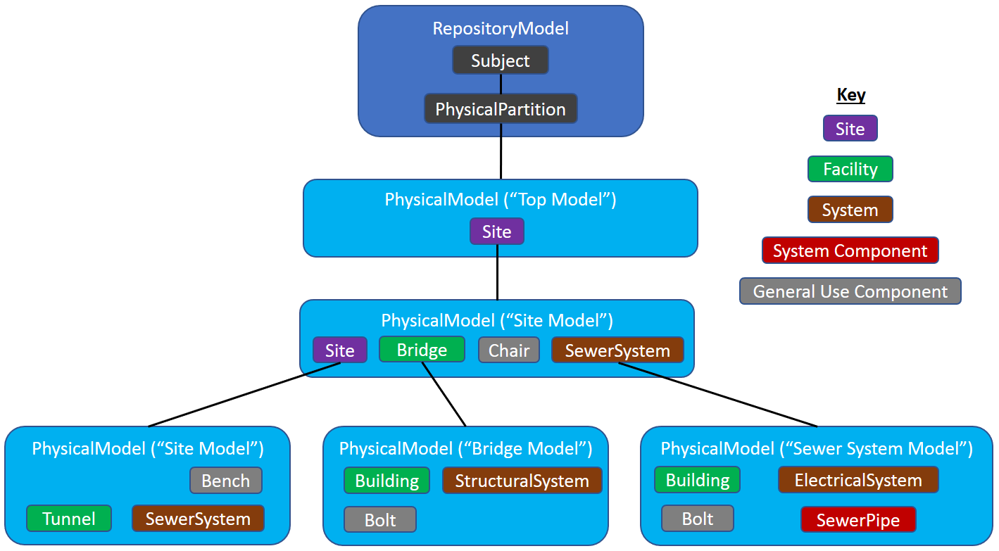

# PhysicalModel Hierarchy

<!-- Responsible for this page: Allan Bommer -->

## Introduction

Each `Subject` in a BIS Repository can have a `PhysicalPartition` child Element, under which the `PhysicalModel`s pertaining to the `Subject` will be organized using mechanisms described in [Model Hierarchy](model-hierarchy.md). The Model Hierarchy is constrained by [Modeling Perspective](modeling-perspective.md), but within the Physical Perspective, it is desirable to further organize Models according to Sites, Facilities, Systems, and Components in order to make the hierarchy of Models understandable by software and users. This section describes “Model Affinity” (a way of specifying “constraints” on the `ModelContainsElements` relationship) and the best-practice for using them to organize the Physical Model Hierarchy.


## Organization Strategy

### Motivations

BIS defines a data model that shared by a growing set of applications and services. Many of these applications and service read and/or write `PhysicalModel` data. There are two choices to ensure that these applications and services will be coordinated:
 - Require every application and service to work with any data organization.
 - Specify a data organization which applications and services should read and write.

 The second option has been chosen for BIS as it is the more practical solution.

### Predictability vs Flexibility / Strong vs Weak Type Safety

A choice must be made between strong type-safety and weak type-safety.

Strong type-safety (*e.g. `RetainingWall` can only be contained in a StructuralSystem Model*), provides strict checking to ensure that type-related rules are always followed, and hence results in very predictable models that software can easily process. However, strong type-safety limits flexibility and can cause frustration (*e.g. I have to create a StructuralSystem Model just to create a single `RetainingWall`?*). Another concern with strong type-safety is that real-project experience with BIS is very limited, so the schema designers understanding of real-world workflows with BIS data is limited; there is a risk of schema designers making strong type-safety decisions that are proved over time to be incorrect.

Therefore, ***Weak type-safety has been selected for the PhysicalModel hierarchy organization.***

Validation rules will be created to determine if `PhysicalElement`s reside in appropriate Models and the `PhysicalModel` hierarchy is *appropriate*,  but there will be no prohibitions that ensure that the `PhysicalModel` hierarchy meets certain standards.

This page provides an overview of the basis of those validation rules and the mechanisms for defining them.

### PhysicalModels and the Elements that they Model

As described in [Model Hierarchy](model-hierarchy.md), every `Model` breaks-down an `Element`. The `Model` and the `Element` represent the same real-world Entity, but the `Model` provides more granular information about the Entity.

Breakdown `Model`s are weakly-typed in BIS. To understand the real-world Entity that a `Model` is modeling, it is necessary to look at the `Element` which the `Model` is breaking down. ***PhysicalModel should not be subclassed.*** The few `PhysicalModel` subclasses that exist are deprecated and should not be used. When terms such as "Site Model" are used, they indicate "a `Model` that breaks down a `Site`", but do not indicate a strongly-typed `SiteModel`.



## ModelAffinity Custom Attribute
While strong-typing is not used, there is still a desire to provide validation of the organization of the data in a `PhysicalModel` hierarchy. To run this validation the software must be able to determine which `Model`s are appropriate containers for each `Element`. This is determined through the `ModelAffinity` custom attribute.

The `ModelAffinity` custom attribute can be applied to any `PhysicalElement` subclass. It declares for the class:
 - Which `Element`s' breakdown `Model`s this `Element` has an affinity for (multiple can be declared).
 - The strength of that affinity.
 - The rationale for the affinity.

There are three levels of affinity strength:
  - *Required* - not residing in an appropriate `Model` should trigger a validation error.
  - *Recommended* - not residing in an appropriate `Model` should trigger a validation warning.
  - *Suggested* - not residing in an appropriate `Model` should trigger a validation note.

In the future, `ModelAffinity` information may be used to provided improved UI tools.

### Example Usage

Here is an example of the `ModelAffinity` custom attribute in use:

```
    <ECEntityClass typeName="StructuralElement" displayLabel="Structural Element" modifier="Abstract">
        <BaseClass>bis:PhysicalElement</BaseClass>
        <ECCustomAttributes>
            <ClassHasHandler xmlns="BisCore.01.00" />
            <ModelAffinity>
              <AffinityStrength>Recommended</AffinityStrength>
              <Rationale>Structural analysis software may not be able to analyze StructuralElements that do not reside in a StructuralSystem breakdown Model.</Rationale>
              <BreakdownModels>
                <string>StructuralPhysical:StructuralSystem</string>
              </BreakdownModels>
            </ModelAffinity/>
        </ECCustomAttributes>
    </ECEntityClass>

```
### Inherited ModelAffinity

`ModelAffinity` cannot be *overridden* in subclasses, but it can be *narrowed*. The effective affinity setting for a class is the sum of all the defined `ModelAffinity` attributes in the class and all of its superclasses.

For example, if:
 - There is a `Pipe` class with a `SewerPipe` subclass.
 - `Pipe` has an affinity to `ISystem`.
 - `SewerPipe` has an affinity to `SewerSystem`

Then the validation for `SewerPipe` would confirm:
 - `SewerPipe` instances reside in `ISystem` `Model`s.
 - `SewerPipe` instances reside in `SewerSystem` `Model`s.

A `SewerPipe` placed in a `Site` `Model` would generate two warnings (or errors) during validation; one for not being in an `ISystem` `Model` and one for not being in a `SewerSystem` `Model`.

When an ancestor class has already defined a `ModelAffinity`, it only makes sense to define a *narrowing* `ModelAffinity` in a subclass. Defining a conflicting `ModelAffinity` is a symptom of the design of the subclass conflicting with the design of the superclass.


### Syntax Details

**TODO: Remove this section after discussion and implementation**

*This custom attribute is written so it could be applied to other Elements (not just PhysicalElements) in the future.*

```
<ECEnumeration typeName="ModelAffinityStrength" backingTypeName="string" isStrict="true">
  <ECEnumerator value="Required" description="Element not residing in this breakdown Model should trigger a validation error."/>
  <ECEnumerator value="Recommended"  description="Element not residing in this breakdown Model should trigger a validation warning."/>
  <ECEnumerator value="Suggested"  description="Element not residing in this breakdown Model should trigger a validation note."/>
</ECEnumeration>

<ECCustomAttributeClass typeName="ModelAffinity" description="Applied to an Element subclass to indicate that the subclass has an affinity to certain types of breakdown Models (i.e. Models breaking down a certain class of Element). This affinity is a "loose" constraint can be used for validation and UI enhancements. Inherited ModelAffinities are also applied." appliesTo="EntityClass">
  <ECProperty propertyName="AffinityStrength" typeName="ModelAffinityStrength" description="The strength of the affinity between the Element and the BreakdownModels in which it may reside."/>
  <ECProperty propertyName="Rationale" typeName="string" description="The reason why the affinity exists."/>
  <ECArrayProperty propertyName="BreakdownModels" typeName="string" description="List of Element subclasses whose breakdown Models are appropriate containers for the class that this custom attribute is applied to. Use format '[SchemaName]:[ClassName]', e.g. 'Fruit:Banana'" minOccurs="1" maxOccurs="unbounded"/>
</ECCustomAttributeClass>
```

### Mixin Classes

`ModelAffinity` custom attribute instances can *refer* to mixin classes, but cannot be *applied* to mixin classes.

The mixin classes `IFacility` and `ISystem` are used in the `ModelAffinity` custom attribute for many key `PhysicalModel` hierarchy classes.

## PhysicalModel Hierarchy Strategy

While `ModelAffinity` provides a mechanism to declare and enforce a PhysicalModel hierarchy, it does does not define a coordinated strategy. The strategy for organizing the hierarchy relies on classifying PhysicalElements into five types:
 - *Site* - An area of land and its contents.
 - *Facility* - A cross-disciplinary Entity such as a building, bridge, tunnel, wharf, etc.
 - *System* - A single discipline physical system, such as structural system, electrical system, sewer system, etc.
 - *System Component* - A component for a particular system.
 - *General-Use Component* - A component that does not have any `ModelAffinity`.

The overall `PhysicalModel` hierarchy strategy is defined in the following table:


| Classification | Affinity to  | Example Classes |
|----------------|----------------|--------------|----------|
| Site           | PhysicalPartition, Site | Site     |
| IFacility       | PhysicalPartition, Site, IFacility, ISystem  *(declared in implementing classes)*           | Building, Bridge, Tunnel     |
| ISystem         | PhysicalPartition, Site, IFacility, ISystem *(declared in implementing classes)*           | SewerSystem, StructuralSystem, etc.     |
| *System | PhysicalPartition, Site, IFacility, ISystem        | SewerSystem, StructuralSystem     |
| *SystemComponent| *System         | SewerPipe, Beam     |
| General-Use Component   | (none)          | Bolt, Chair    |


These types and their behaviors are explained below, along with the behaviors of their breakdown `PhysicalModel`s if they have breakdown `Model`s.

### Site

`Site` is class that represents an region of land and all that is contained on, above and below that land.

<!-- Should Site be Sealed? -->

In conversation (and writing) the `Model`s that break down `Site` `Element`s are referred to as `Site` `Model`s, even thought there is not a strongly-typed `SiteModel` class. By convention, the top-most `Model` in a `PhysicalModel` hierarchy is considered a Site `Model`, even though it breaks down `PhysicalPartition`. The top `Model` is considered as a `Site` `Model` as nearly all infrastructure that is modeled with BIS can benefit from having a site context.

`Site` `Model`s typically contain `Site`, `IFacility`, `ISystem` and General-Use `PhysicalElement`s.

`Site` `Elements` should only be placed in `Site` `Model`s (and `PhysicalPartition` `Model`s). `Site` `Elements` placed in any other `Model` will generate validation warnings.

### IFacility

`IFacility` is a mixin class that represents a significant multi-disciplinary infrastructure Entity that corresponds well to user concepts. Buildings, bridges, tunnels, wharves, and towers are all examples of multi-discipline Entities that are modeled with a `PhysicalElement` subclass that includes the `IFacility` mixin.

In conversation (and writing) the `Model`s that break down `IFacility` `Element`s are referred to as `Facility` `Model`s, even thought there is not a strongly-typed `IFacilityModel` class. These `Model`s are usually referred to by their more-specific `Element` types (e.g. `Building` `Model`s are `Model`s that break down `Building` `Element`s.)

`IFacility` `Model`s typically contain `IFacility`, `ISystem` and `General-Use` `PhysicalElement`s.

`IFacility` `Elements` may be placed in `Site`, `IFacility` and `ISystem` `Model`s. `IFacility` `Element`s placed in any other `Model` will generate validation warnings.

*To implement this behavior every class that includes the `IFacility` mixin must include a `ModelAffinity` custom attribute that indicates a "Recommended" affinity to `PhysicalPartition`, `Site`, `IFacility` and `ISystem`.*

### ISystem

`ISystem` is a mixin class that represents a significant discipline-specific arrangement of Entities intended to fulfill one or more functions. Sewers, roadways, HVAC and fire-suppression systems are all examples of real-world Entities that are modeled with `ISystem` subclasses. `ISystem` subclasses tend to be suffixed with 'System' (e.g. StructuralSystem, SewerSystem); 'Network' is another commonly used suffix for these classes (e.g. RoadNetwork).

Architecture is also considered an `ISystem`, as it is discipline-specific and has the same general behaviors at the other `ISystem`s.

In conversation (and writing) the `Model`s that break down `ISystem` `Element`s are referred to as `System` `Model`s, even thought there is not a strongly-typed `ISystemModel` class. These `Model`s are usually referred to by their more-specific `Element` types (e.g. `SewerSystem` `Model`s are `Model`s that break down `SewerSystem` `PhysicalElements`.)

`ISystem` `Model`s may contain `IFacility`, `ISystem` and General-Use `PhysicalElement`s, as well as components specific to the particular `ISystem` (e.g. `SewerPipe` in `SewerSystem`)

`ISystem` `Elements` may be placed in `Site`, `IFacility` and `ISystem` `Model`s. `ISystem` `Element`s placed in any other `Model` will generate validation warnings.

*To implement this behavior every class that includes the `ISystem` mixin must include a `ModelAffinity` custom attribute that indicates a "Recommended" affinity to `PhysicalPartition`, `Site`, `IFacility` and `ISystem`.*

### System Components

System Component represents an Entity that is part of a specific `ISystem` and generally does not makes sense outside of the specific system (e.g. sewer pipe outside of sewer system). System Component is not a BIS class, nor mixin.

System Components are identified by their `ModelAffinity` with a specific `ISystem` subclass.

System Components rarely have breakdown `Model`s.

System Component `Elements` should only be placed in their related `System` `Model`s. System Component `Elements` placed in any other `Model` will generate validation warnings.

*To implement this behavior every System Component class must define or inherit a `ModelAffinity` custom attribute that indicates a "Recommended" (or stronger) affinity to the particular `ISystem` class that is appropriate for the System Component.*

### General-Use Components

`General-Use Components` represents Entities such as bolts and chairs which are not specific to any discipline or facility.

General-Use Components are identified by their lack of any `ModelAffinity`.

General-Use Components rarely have breakdown `Model`s.

General-Use `Elements` can be placed in any `PhysicalModel`. General-Use Components never generate validation warnings.

## Example

The following diagram illustrates all variations of the PhysicalModel hierarchy breakdown that will *not* generate warnings or errors.




