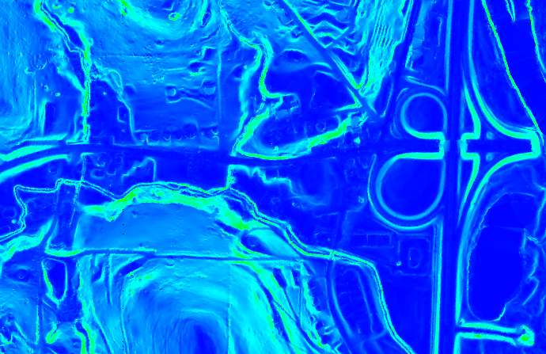
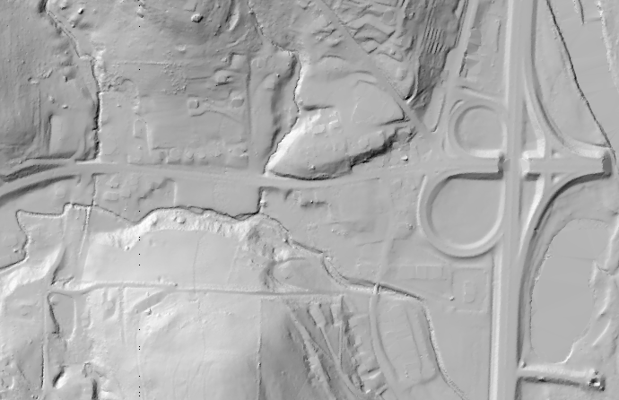

# NextVersion

## Thematic display

### New gradient modes

Thematic display supports several new gradient mode values for the `mode` property of [ThematicGradientSettings]($common):
* `ThematicGradientMode.Stepped` applies a stepped color gradient to the scene.
* `ThematicGradientMode.SteppedWithDelimiter` applies a stepped color gradient to the scene with delimiters (lines between the color steps).
* `ThematicGradientMode.IsoLines` applies isolines to the scene to achieve an effect similar to a contour map.

Note: Gradient modes `ThematicGradientMode.SteppedWithDelimiter` and `ThematicGradientMode.IsoLines` cannot be used with thematic display mode values other than `ThematicDisplayMode.Height`.

Stepped thematic gradient mode applied to height

Stepped-with-delimiter thematic gradient mode applied to height

Isoline thematic gradient mode applied to height

### New display modes

Thematic display supports several new display mode values for the `displayMode` property of [ThematicDisplay]($common):
* `ThematicDisplayMode.Slope` applies a color gradient to surface geometry based on the slope of the surface relative to a specified axis. The slope value is calculated based on the angle between the surface and the axis specified in the associated [ThematicDisplay]($common) object.
* `ThematicDisplayMode.HillShade` applies a color gradient to surface geometry based on the direction of a sun shining on the surface.
  * [ThematicDisplay]($common) has a new property named `sunDirection`, a 3d vector, which describes the solar direction used by this display mode.
  * If desired, in order to create a sun direction from azimuth and altitude values, a new API function is available: [calculateSolarDirectionFromAngles]($common). This function takes an azimuth and altitude as input and returns a solar direction vector.

Slope display mode applied relative to a Z axis with a range of 0 to 90 degrees and a blue-red color scheme

Hillshade display mode applied with a monochrome color scheme

## Hyper-modeling

The hyper-modeling [Extension]($frontend) has been replaced by the `hypermodeling-frontend` package to permit customization of its behavior.

* Use [HyperModeling.initialize]($hypermodeling) to initialize the package before using any of its APIs.
* Use [HyperModeling.startOrStop]($hypermodeling) to enable or disable hypermodeling for a [Viewport]($frontend).
* Use [HyperModelingConfig]($hypermodeling) to customize the package's behavior.

## ECSql Enhancements

Added these expressions and functions

1. `<type> IS [NOT] (type-list)` - Filter parent type by subtype
    * [Lesson 9: Type Filter](../learning/ECSQLTutorial/TypeFilter.md)
1. `CASE-WHEN-THEN-ELSE` - Conditional expression
    * [Lesson 10: Conditional Expressions](../learning/ECSQLTutorial/ConditionalExpr.md)
1. `IIF()`  - Conditional expression
    * [Lesson 10: Conditional Expressions](../learning/ECSQLTutorial/ConditionalExpr.md)
1. `ec_classname()` - Get formatted class names for a ECClassId
    * [Lesson 11: Built-In functions](../learning/ECSQLTutorial/BuiltInFunctions.md)
1. `ec_classid())` - Get ECClassId from a  qualified classname.
    * [Lesson 11: Built-In functions](../learning/ECSQLTutorial/BuiltInFunctions.md)
