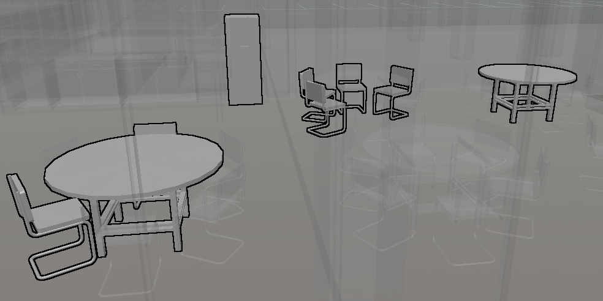

# NextVersion

## Silhouettes for emphasis

The [Hilite]($common) effect can now be applied to individual features (elements, models, subcategories, etc) using [FeatureSymbology.Overrides]($frontend). The color, color ratios, and silhouette width can all be customized using [Viewport.emphasisSettings]($frontend) - the default settings apply a thick black silhouette to emphasized features with no effect on the features' own colors. If you are using [EmphasizeElements]($frontend), set its `wantEmphasis` property to control whether or not the emphasis settings are applied. Otherwise, have your [FeatureOverrideProvider]($frontend) specify which features are emphasized using [FeatureSymbology.Appearance.emphasized]($frontend) and optionally override [Viewport.emphasisSettings]($frontend).

## Geometry

* [PolyfaceBuilder.addGreedyTriangulationBetweenLineStrings]($geometry) method to build triangles "between" loosely related linestrings.
* [RegionOps.consolidateAdjacentPrimitives]($geometry) method to consolidate adjacent lines and linestrings, and adjacent arcs of the same underlying circle or ellipse.
* [RegionOps.rectangleEdgeTransform]($geometry) method to decide if a Loop object or point array is a simple rectangle.

