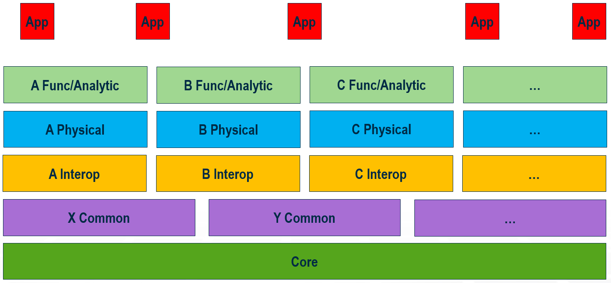

# BIS Organization

## Introduction

BIS is intended to be extended and revised over time. It is designed to be modular, so new problem spaces can be addressed incrementally as new Domains are added, layered on the core Schemas.

To anticipate this, the approach for BIS is to:

1. Build on a solid theoretical foundation.
2. Use a layered and compartmentalized organization.
3. Have unifying organizational principals.
4. Include a wide variety of perspectives and requirements in the development
5. Vet the design with real use cases.

\#2 and \#3 are discussed in this chapter.

## A Family of Schemas

BIS will expand to include all disciplines that participate in designing, constructing, operating and maintaining infrastructure. A single schema that represented that huge scope would be very difficult to design, understand and maintain. BIS is consciously trying to avoid the problems associated with “the mother of all schemas”.

BIS is not a monolithic schema, but is modularized into a family of “domain” Schemas. Those Schemas are organized into a clear hierarchy, as shown in the following figure.

Schemas in any layer may refer to (be dependent upon) schemas in any lower layer. The layers of the schema hierarchy are intended to avoid circular dependencies while still allowing different domains to interoperate.

At the base of this hierarchy is the BisCore domain. BisCore defines the “fabric of the universe” and some key organizational strategies. All classes in other layers descend from classes in the BisCore allowing BIS-based software to understand – at least at some basic level – all BIS schemas, even BIS schemas it has never seen before.

Above the Core is the Common layer. This layer is where concepts that span multiple disciplines are defined. Examples of these concepts are “grid lines”, “building”, “bridge”, “linear referencing”, “schedule”, etc.. There will likely be many Common Domains.

The next 3 layers are divided horizontally by discipline (the “A”, “B” and “C”) and vertically by purpose (“Interop”, “Physical” and “Func/Analytical”):

- The Interop layer is for defining mix-ins or other concepts that other disciplines will need to implement or reference; an example might be an IElectricalLoad mix-in that allows other disciplines to define that instances of their classes have electrical power requirements.

- The Physical layer is for defining real-world physical entities and closely associated information.

- The Func/Analytical layer is for defining functional data (such as the process data behind P&ID drawings) and analytical data (such as the structural behavior data that is used to analyze a structure).

The top layer is for the App schemas. These schemas are intended to be very small, and contain no data that any other application would need or want to access. Most data that is currently considered application data will be found in the discipline or common layers.

## BIS Compatibility Grades for Schemas

The conversion of products to use BIS Domain Schemas can occur incrementally, but an ecosystem of BIS-based infrastructure (including iModelHub and Navigator) is rapidly expanding. This creates a short-term need for BIS-based “compatibility” schemas that have not been as rigorously designed as true BIS schemas but allow usage and some level of interoperability with the BIS ecosystem. For this reason, a grading level for BIS schemas has been created:

- *Grade A*: True BIS schemas carefully designed for editing and interoperability
- *Grade B*: Either:
  - Legacy “consensus” schemas (such as ISM), intelligently converted to BIS, or
  - New BIS schemas, with one-way conversion to BIS in mind, but not intended for editing (native format).
- *Grade C*: Legacy schema, intelligently converted to follow basic BIS rules and patterns.
- *Grade D*: Legacy schema, auto-converted

## Physical Backbone

A key organizational strategy for both the BIS schemas and the organization of data within BIS repositories is the “physical backbone”. For schema design the physical world is a unifying reality upon which all disciplines can agree when coming to a consensus on how to represent something in BIS.

Within a BIS repository, the representation of the physical world becomes the framework upon which we can organize other data. All data in BIS repositories is expected to be about or related to physical infrastructure. The physical infrastructure is modeled as a hierarchy and other non-physical information is stored relative to that hierarchy.

> Next: [Fabric of the Universe](./fabric-of-the-universe.md)