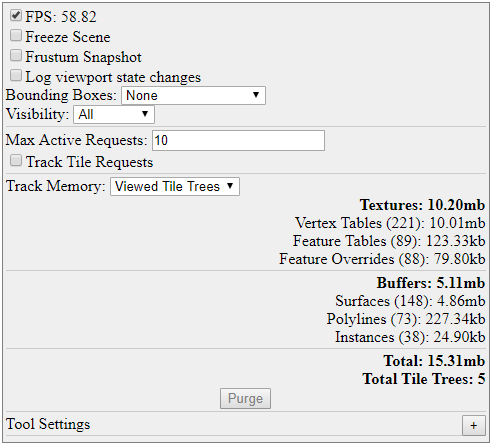

# NextVersion

## Update to TypeScript 3.5

For the 1.0 release, iModel.js was using TypeScript 3.2. In order to take advantage of recent improvements, iModel.js has moved up to TypeScript 3.5. One of the main features of interest was the incremental build support. TypeScript 3.5 also includes some enhanced error checking over what was available in 3.2. This makes it easier to identify potential problems, but also may mean that source code that successfully compiled using 3.2 may require minor adjustments to compile using 3.5.

Please see the [TypeScript Roadmap](https://github.com/Microsoft/TypeScript/wiki/Roadmap) for more details.

## New frontend-devtools package

The new `frontend-devtools` package contains a collection of simple UI widgets providing diagnostics and customization related to the display system. These include:

  * `MemoryTracker` - reports on total GPU memory usage, breaking it down by different types of objects like textures and buffers. Memory can be reported for all tile trees in the system or only those currently displayed in the viewport.
  * `FpsTracker` - reports average frames-per-second. Note: this forces the scene to be redrawn every frame, which may impact battery life on laptops and mobile devices.
  * `TileStatisticsTracker` - reports exhaustive tile request statistics, including the current numbers of active and pending requests, the total number of completed, dispatched, failed, and timed-out requests, and more.
  * `ToolSettingsTracker` - allows settings affecting the operation of viewing tools to be customized.

These widgets may be used in any combination. Alternatively, `DiagnosticsPanel` bundles them all together as a set of expandable panels along with a handful of other features like freezing the current scene, controlling display of tile bounding boxes, and hiding particular types of geometry.



## Display system optimizations

Many incremental enhancements contributed to improved performance and quality of the rendering system and decreased memory usage, including:

  * Reducing the number of tiles requested and expediently cancelling requests for tiles which are no longer needed.
  * Improving culling logic - this particularly improves performance when a clip volume is applied to the view.
  * Reclaiming memory from not-recently-drawn tiles.
  * Decompressing texture images in the background using web workers.
  * Eliminating distortion of text, and of the skybox in orthographic views.
  * Enabling tiles to be downloaded without edge data, and optimizing shaders to more efficiently render tiles without edges.


## Changes to how binary type ECProperty with `extendedTypeName="BeGuid"` is treated in ECSql query

### When such property like `FederationGuid` from `bis.Element` is queried, now return `string` representation of Guid. Previously it returned a 16 byte `uint8array`

```js
  for await (const row of conn.query("SELECT FederationGuid FROM bis.Element WHERE FederationGuid IS NOT NULL")) {
    // expect row.federationGuid as string type of format "xxxxxxxx-xxxx-xxxx-xxxx-xxxxxxxxxxxx"
    // previously it was returning a 16 byte uint8array
  }
```

### When searching on property like `FederationGuid` from `bis.Element` both uint8array and string type parameter is supported

```js
  // Bind string representation of Guid can now be binded to ECSql query.
  for await (const row of conn.query("SELECT FederationGuid FROM bis.Element WHERE FederationGuid = ?", ["xxxxxxxx-xxxx-xxxx-xxxx-xxxxxxxxxxxx"])) {
    // expect row.federationGuid as string type of format "xxxxxxxx-xxxx-xxxx-xxxx-xxxxxxxxxxxx"
    // previously it was returning a 16 byte uint8array
  }
```

### Directly using Guid string in ECSql is not directly supported yet. If its necessary, use helper ECSql function `GuidToStr(B)` or `StrToGuid(S)` instead

```js
  // WARNING following will not work as of now as no implicit conversation take place between BINARY and STRING. This will be fixed in future version.
  for await (const row of conn.query("SELECT FederationGuid FROM bis.Element WHERE FederationGuid = 'xxxxxxxx-xxxx-xxxx-xxxx-xxxxxxxxxxxx'")) {
    // ...
  }
```

### Use StrToGuid() to parse string version of Guid into a binary version of Guid

```js
  for await (const row of conn.query("SELECT FederationGuid FROM bis.Element WHERE FederationGuid = StrToGuid('xxxxxxxx-xxxx-xxxx-xxxx-xxxxxxxxxxxx')")) {
    // ...
  }
```

### Use GuidToStr() to convert binary Guid to string version of Guid

```js
  for await (const row of conn.query("SELECT FederationGuid FROM bis.Element WHERE GuidToStr(FederationGuid) = 'xxxxxxxx-xxxx-xxxx-xxxx-xxxxxxxxxxxx'")) {
    // ...
  }
```

## ECSQL support for correlated subqueries

ECSql now supported following syntax for correlated subqueries
```
  [NOT] EXISTS (<subquery>)
```
### Example
```sql
SELECT ECInstanceId FROM bis.Element E
  WHERE EXISTS (
      SELECT 1 FROM meta.ECClassDef C WHERE C.ECInstanceId = E.ECClassId AND C.Name='Pump')

SELECT ECInstanceId FROM bis.Element E
  WHERE NOT EXISTS (
      SELECT 1 FROM meta.ECClassDef C WHERE C.ECInstanceId = E.ECClassId AND C.Name='Pump')

```

## ECSQL support for bitwise operators
ECSql now supported following bitwise operator. The operand is treated as int64

* `~` not
* `|` or
* `&` and
* `<<` left-shift
* `>>` right-shift

### Example
```sql
SELECT 2 & prop FROM test.Foo WHERE prop & 2 = 2

SELECT 2 | prop FROM test.Foo WHERE prop | 2 = 2

SELECT *  FROM test.Foo WHERE (1 << 2) & prop

SELECT * FROM test.Foo WHERE ~prop & 2;
```
