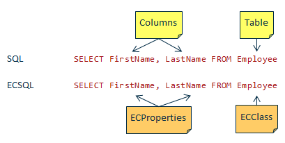

# Key to ECSQL

ECSQL is an implementation of SQL — a proven, well-adopted text-based command language. It sticks to
standard SQL (SQL-92 and SQL-99) wherever possible.

ECSQL has two key characteristics which are important to understand. Once understood, you have basically completed this tutorial already successfully.

Let's start by looking at the differences between ECSQL and SQL.

This is a simple **SQL** statement:

```sql
SELECT FirstName, LastName FROM Employee WHERE Company='ACME'
```

It returns the first and last name of all employees working for the company ACME.

Guess, how it looks like in **ECSQL**? Here it is:

```sql
SELECT FirstName, LastName FROM Employee WHERE Company='ACME'
```

As you can see, there is **no syntactical difference** between ECSQL and SQL in that example. And that is true for ECSQL in general.

> **Try it yourself**
>
> *Goal:* Find out how many Elements there are in the iModel.
>
> *ECSQL*
> ```sql
> SELECT count(*) FROM bis.Element
> ```
>
> *Result*
>
> count(*) |
> --- |
> 4 |

There is a **semantic** difference however: ECSQL targets the **business data model**, i.e. your domain's ECSchema, whereas SQL targets the **database's schema**.



Where you have tables and columns in SQL, you have ECClasses and ECProperties in ECSQL. In particular this means, that you never have to know anything about the database schema in the iModel. You never have to know table or column names. **All you need to know is your ECSchemas and their ECClasses and ECProperties.**

That abstraction is a huge simplification for ECSQL users. The database schema of an iModel is optimized for performance and file size and uses techniques where classes are spread across multiple tables and different properties map to the same column. That makes the database schema complex, which is not a problem as no user has to understand it.

> Summary
>
> - ECSQL has the same syntax as SQL
> - ECSQL targets the business data model (ECSchemas)

---

[**< Previous**](./index.md)  &nbsp; | &nbsp; [**Next >**](./FirstExamples)
