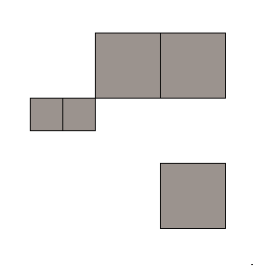
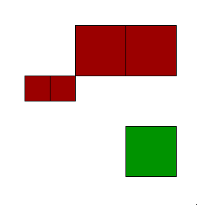

# Examples of `PolyfaceQuery` methods

## Partitioning by vertex and edge connectivity

|  |  |
---|---|
| A single mesh with 5 facets  |  |
| create arrays of facet indices that share any vertex contact  | const facetIndexArraysWithVertexConnectivity = PolyfaceQuery.partitionFacetIndicesByEdgeConnectedComponent(polyface) |
| extract as separate meshes |  const fragmentPolyfaces = PolyfaceQuery.clonePartitions(polyface, facetIndexArraysWithVertexConnectivity);|
| 2 separate Polyface meshes (red, green), each with at least vertex-to-vertex connectivity | |
| create arrays of facet indices that share an entire edge  | const facetIndexArraysWithEdgeConnectivity = PolyfaceQuery.partitionFacetIndicesByEdgeConnectedComponent(polyface) |
| extract as separate meshes |  const fragmentPolyfaces = PolyfaceQuery.clonePartitions(polyface, facetIndexArraysWithEdgeConnectivity);|
| 3 separate Polyface objects (blue, drab, magenta), each with at least edge-to-edge connectivity | |

Unit Test
  * source: imodeljs\core\geometry\src\test\clipping\PolyfaceQuery.test.ts
  * test name: "PartitionFacetIndicesByConnectivity"
  * output: imodeljs\core\geometry\src\test\output\PolyfaceQuery\PartitionFacetsByConnectivity.imjs

