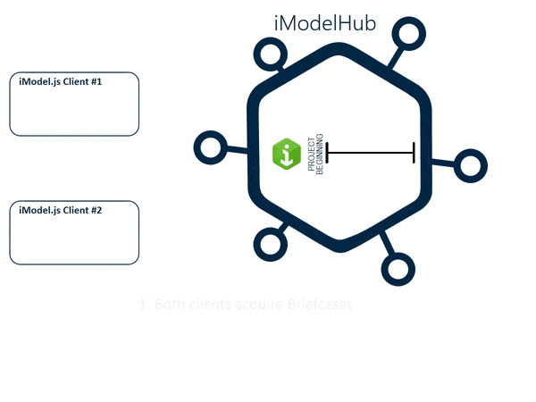

# Briefcases

[Briefcases](../Glossary.md#briefcase) are the local copies of iModel that users can *acquire* to work with the iModel. Users can make changes to their copy of iModel and then [*push*](../Glossary.md#briefcase) them as a single [ChangeSet](../Glossary.md#changeset) file into iModelHub.

## ChangeSets

Briefcases synchronize their changes through ChangeSets. ChangeSets form a linear [timeline](./index.md#the-timeline-of-changes-to-an-imodel) of iModel changes. To do this ChangeSets have to be in a strict order and must be *based on* a single parent ChangeSet.

### ChangeSet id

ChangeSet id is a 40 characters SHA1 hash that is used to validate ChangeSet. The id of ChangeSet is generated from the id of its parent as well as its contents. That means if the ChangeSet is rebased to have a different parent or additional local changes are added before pushing, the id of the ChangeSet would have to be changed.

## Briefcase id

Each Briefcase has a unique 24bit integer id. Briefcase id is written into the iModel file after download and is used to identify where changes have occurred.

* Every Element id contains the id Briefcase where it was created.
* Every ChangeSet has an id of the Briefcase that pushed it.
* [Locks and Codes](../backend/ConcurrencyControl.md) contain an id of the Briefcase that they belong to.

> Since Briefcase ids are limited, it is recommended to reuse briefcases instead of acquiring new ones. There are limits how many Briefcases a single user can acquire per minute/total to prevent users accidentally acquiring too many Briefcases.

## Working with briefcases

To work with Briefcases, [BriefcaseDb]($backend) methods should be used instead of calling iModelHub API directly:

* [Acquiring and opening a briefcase](../backend/IModelDb.md)
* [Pulling changes](../backend/IModelDbSync.md)
* [Creating and pushing changes](../backend/IModelDbReadwrite.md)
