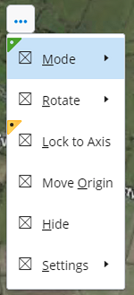
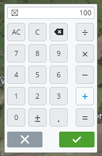

# UiAdmin

The [UiAdmin]($ui-abstract) class contains an API used to display a
Context Menu, Toolbar, Menu Buttons, Calculator, various editors and an HTML element.
The UiAdmin methods are callable from `IModelApp.uiAdmin` in the imodeljs-frontend package.

## API Functions

### showContextMenu

The `showContextMenu` function shows a context menu at a particular location.
The menu items are an array of [AbstractMenuItemProps]($ui-abstract).

The following example shows abstract menu item definitions. Both items and sub-menus are shown.

```ts
private static _exampleMenuItems: AbstractMenuItemProps[] = [
  {
    id: "Mode", label: "~Mode", icon: "icon-placeholder", badgeType: BadgeType.New,
    submenu: [
      { id: "0", item: { label: "Mode 1", icon: "icon-placeholder", badgeType: BadgeType.New, execute: () => { } } },
      { id: "1", item: { label: "Mode 2", icon: "icon-placeholder", badgeType: BadgeType.TechnicalPreview, execute: () => { } } },
    ],
  },
  {
    id: "Rotate", label: "~Rotate", icon: "icon-placeholder",
    submenu: [
      { id: "0", item: { label: "Rotate 1", icon: "icon-placeholder", execute: () => { } } },
      { id: "1", item: { label: "Rotate 2", icon: "icon-placeholder", execute: () => { } } },
    ],
  },
  {
    id: "LockToAxis", item: { label: "~Lock to Axis", icon: "icon-placeholder", badgeType: BadgeType.TechnicalPreview, execute: () => { } },
  },
  {
    id: "MoveOrigin", item: { label: "Move ~Origin", icon: "icon-placeholder", execute: () => { } },
  },
  {
    id: "Hide", item: { label: "~Hide", icon: "icon-placeholder", execute: () => { } },
  },
  {
    id: "Settings", label: "~Settings", icon: "icon-placeholder",
    submenu: [
      { id: "0", item: { label: "Settings 1", icon: "icon-placeholder", execute: () => { } } },
      { id: "1", item: { label: "Settings 2", icon: "icon-placeholder", execute: () => { } } },
    ],
  },
];
```

This function call example uses the `_exampleMenuItems` above and displays those menu items at the current cursor position.

```ts
IModelApp.uiAdmin.showContextMenu(this._exampleMenuItems, IModelApp.uiAdmin.cursorPosition);
```

The menu items are displayed at the cursor.


### showMenuButton

The `showMenuButton` function shows a menu button at a particular location. A menu button opens a context menu.
Multiple menu buttons may be displayed and each button is given an id.
This function call example uses the `_exampleMenuItems` above and displays the menu button at a particular location on the selected viewport.

```ts
const viewport = IModelApp.viewManager.selectedView;
if (viewport) {
  IModelApp.uiAdmin.showMenuButton("test1", this._exampleMenuItems, IModelApp.uiAdmin.createXAndY(150, 150), viewport.toolTipDiv);
}
```

The `hideMenuButton` hides a menu button with a given id.

```ts
IModelApp.uiAdmin.hideMenuButton("test1");
```

#### Closed Menu Button


#### Open Menu Button



### showToolbar

The `showToolbar` function shows a Toolbar at a particular location.
The toolbar items are an array of [AbstractToolbarProps]($ui-abstract).

The following example shows an array of abstract toolbar items with item priorities that establish their order.

```ts
private static _exampleToolbar = (): AbstractToolbarProps => {
  return {
    toolbarId: "example-toolbar",
    items: [
      {
        id: SelectionTool.toolId,
        itemPriority: 10,
        icon: SelectionTool.iconSpec, label: SelectionTool.flyover, description: SelectionTool.description,
        execute: () => IModelApp.tools.run(SelectionTool.toolId),
      },
      {
        id: FitViewTool.toolId,
        itemPriority: 20,
        icon: FitViewTool.iconSpec, label: FitViewTool.flyover, description: FitViewTool.description,
        execute: () => IModelApp.tools.run(FitViewTool.toolId, IModelApp.viewManager.selectedView, true),
      },
      {
        id: WindowAreaTool.toolId,
        itemPriority: 30,
        icon: WindowAreaTool.iconSpec, label: WindowAreaTool.flyover, description: WindowAreaTool.description,
        execute: () => IModelApp.tools.run(WindowAreaTool.toolId, IModelApp.viewManager.selectedView),
      },
      {
        id: ZoomViewTool.toolId,
        itemPriority: 40,
        icon: ZoomViewTool.iconSpec, label: ZoomViewTool.flyover, description: ZoomViewTool.description,
        execute: () => IModelApp.tools.run(ZoomViewTool.toolId, IModelApp.viewManager.selectedView),
      },
      {
        id: PanViewTool.toolId,
        itemPriority: 50,
        icon: PanViewTool.iconSpec, label: PanViewTool.flyover, description: PanViewTool.description,
        execute: () => IModelApp.tools.run(PanViewTool.toolId, IModelApp.viewManager.selectedView),
      },
      {
        id: RotateViewTool.toolId,
        itemPriority: 60,
        icon: RotateViewTool.iconSpec, label: RotateViewTool.flyover, description: RotateViewTool.description,
        execute: () => IModelApp.tools.run(RotateViewTool.toolId, IModelApp.viewManager.selectedView),
      },
      { id: "example-mode-1", itemPriority: 70, label: "Mode 1", icon: "icon-placeholder",
        badgeType: BadgeType.New, execute: () => { } },
      { id: "example-mode-2", itemPriority: 80, label: "Mode 2", icon: "icon-placeholder",
        badgeType: BadgeType.TechnicalPreview, execute: () => { } },
    ],
  };
}
```

The following are handler functions. The `_closeToolbar` function closes the toolbar by calling `UiAdmin.hideToolbar`.

```ts
private static _toolbarItemExecuted = (_item: ActionButtonItemDef) => {
  ExamplePopupTools._closeToolbar();
}

private static _toolbarCancel = () => {
  ExamplePopupTools._closeToolbar();
}

private static _closeToolbar() {
  IModelApp.uiAdmin.hideToolbar();
}
```

This function call example uses the `_exampleToolbar` above and displays the toolbar at the current cursor position.
The relative position defaults to the top-right. This can be overridden using the optional 6th param.

```ts
IModelApp.uiAdmin.showToolbar(
  this._exampleToolbar(), IModelApp.uiAdmin.cursorPosition, IModelApp.uiAdmin.createXAndY(8, 8),
  this._toolbarItemExecuted, this._toolbarCancel);
```


### showCalculator

The `showCalculator` function shows a calculator at a particular location.

The following are handler functions. The `_closeCalculator` function closes the toolbar by calling `UiAdmin.hideCalculator`.

```ts
private static _calculatorOnOk = (value: number) => {
  IModelApp.notifications.outputMessage(new NotifyMessageDetails(OutputMessagePriority.Info, `Calculated value is ${value}`));
  ExamplePopupTools._closeCalculator();
}

private static _calculatorOnCancel = () => {
  ExamplePopupTools._closeCalculator();
}

private static _closeCalculator() {
  IModelApp.uiAdmin.hideCalculator();
}
```

This function call example displays the calculator at the current cursor position.
A default value and an icon specification are supplied.

```ts
IModelApp.uiAdmin.showCalculator(100, "icon-placeholder", IModelApp.uiAdmin.cursorPosition,
  this._calculatorOnOk, this._calculatorOnCancel);
```



### Input Editors

There are several functions to display input editors for specific types of values, including
`showAngleEditor`,
`showLengthEditor`, and
`showHeightEditor`.
The `showInputEditor` function can be used to display the input editor appropriate for a given [PropertyDescription]($ui-abstract).

The following are handler functions. The `_closeInputEditor` function closes the toolbar by calling `UiAdmin.hideInputEditor`.

```ts
private static _numberInputCommit = (value: number) => {
  IModelApp.notifications.outputMessage(new NotifyMessageDetails(OutputMessagePriority.Info, `Updated value is ${value}`));
  ExamplePopupTools._closeInputEditor();
}

private static _inputCommit = (value: Primitives.Value) => {
  IModelApp.notifications.outputMessage(new NotifyMessageDetails(OutputMessagePriority.Info, `Updated value is ${value}`));
  ExamplePopupTools._closeInputEditor();
}

private static _inputCancel = () => {
  ExamplePopupTools._closeInputEditor();
}

private static _closeInputEditor() {
  IModelApp.uiAdmin.hideInputEditor();
}
```

#### showAngleEditor

This function call example displays an angle editor at the current cursor position.

```ts
IModelApp.uiAdmin.showAngleEditor(90, IModelApp.uiAdmin.cursorPosition, this._numberInputCommit, this._inputCancel);
```

#### showLengthEditor

This function call example displays a length editor at the current cursor position.

```ts
IModelApp.uiAdmin.showLengthEditor(90, IModelApp.uiAdmin.cursorPosition, this._numberInputCommit, this._inputCancel);
```


#### showHeightEditor

This function call example displays a height editor at the current cursor position.

```ts
IModelApp.uiAdmin.showHeightEditor(30, IModelApp.uiAdmin.cursorPosition, this._numberInputCommit, this._inputCancel);
```


#### showInputEditor

This function call example displays a generic number editor at the current cursor position.

```ts
const propertyDescription: PropertyDescription = { name: "test", displayLabel: "Test", typename: "number" };
IModelApp.uiAdmin.showInputEditor(30, propertyDescription, IModelApp.uiAdmin.cursorPosition, this._inputCommit, this._inputCancel);
```

## API Reference

* [UiAdmin]($ui-abstract)
