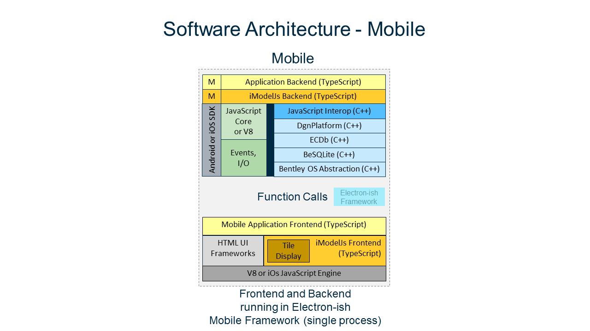
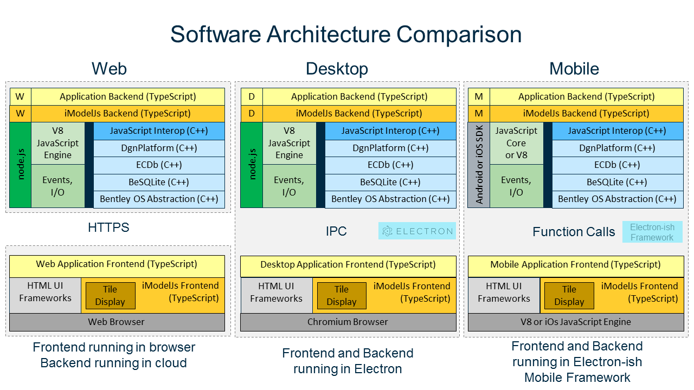

# Software Architecture for iModelJs Apps

The software architecture of iModelJs was driven by the following goals:

- Support iModel-based services running in any cloud or on premises
- Support iModel-based web/desktop/mobile apps
- Re-use business logic across web, desktop, and mobile apps
- Re-use HTML GUI across web, desktop, and mobile apps

[Backend](../learning/backend) Architecture Layers:

- Application Backend (TypeScript)
- iModelJs Backend Framework (TypeScript)
- JavaScript Runtime with C++ Interoperability
- iModelJs Native Libraries (C++)

[Frontend](../learning/frontend) Architecture Layers:

- Application Frontend (TypeScript)
- iModelJs Frontend Framework (TypeScript)
- HTML GUI
- Web Browser

## Web

iModelJs Web App backends are [Node.js](http://www.nodejs.org) applications.
Node.js provides the [V8 JavaScript Engine](https://developers.google.com/v8/) and the [N-API](https://github.com/nodejs/abi-stable-node) for writing Node Addons in C++.
This is how the iModelJs Native Libraries are exposed to the iModelJs backend framework.
Portable application logic is written in TypeScript and calls TypeScript APIs exposed from the `@bentley/imodeljs-backend` package.

Notice that the backend architecture is identical between Agents and interactive Web Applications.

Web App frontends run in a web browser and use HTML GUI for presentation and APIs exposed from the `@bentley/imodeljs-frontend` package for *Remote Procedure Calls* (RPC) into functionality implemented on the backend.

The [frontend --> backend communication](./RpcInterface.md) is over HTTPS for interactive web applications.

 [Write an interactive Web app](../learning/WriteAnInteractiveWebApp.md)

 [Write a Web service](../learning/WriteAWebService.md)

 [Write a Web agent](../learning/WriteAWebAgent.md)

## Desktop

iModelJs desktop applications use the [Electron](https://electronjs.org/) Framework.
The backend architecture is the same as with iModelJs Web Apps because Electron also uses Node.js.
The only difference in the frontend architecture is that an embedded [Chromium Browser](https://www.chromium.org/Home) replaces a standalone Web Browser.

The [frontend --> backend communication](./RpcInterface.md) is over *Inter Process Communication* (IPC) as provided by Electron.

 [Write a desktop app](../learning/WriteAnInteractiveDesktopApp.md)

## Mobile

iModelJs mobile applications use the JavaScript Engine and Web Browser GUI controls built into the Android SDK and iOS SDK.

The [frontend --> backend communication](./RpcInterface.md) is over function calls and messages between two separate JavaScript contexts.

 [Write a mobile app](../learning/WriteAnInteractiveMobileApp.md)

## Comparison

The following diagram compares the architecture of web, desktop, and mobile applications and shows how the goals of portability and reuse are accomplished.

